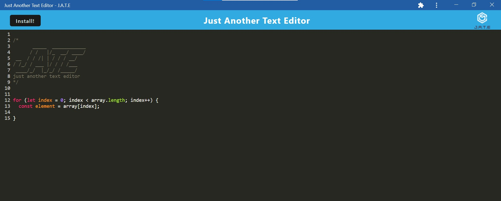

# pwa-javascript-text-editor

  

  # Description
  
  A progressive web app that uses a client/server folder structure to make use of webpack to bundle and minify the client files. The text-editor uses JavaScript syntax highlighting thanks to code-mirror. The progressive web app makes use of service workers and workbox CacheFirst strategies to allow the text-editor to work while offline. The web app is installable from the browser. The text-editor saves data using indexDB.

  # Table of Contents
  
  - [Installation](#installation)
  - [Usage](#usage)
  
  - [Deployed](#deployed)
  - [Tests](#tests)
  - [Questions](#questions)

  # Installation
  
  Node.js, NPM packages: concurrently, eslint, nodemon, express, if-env, babel-loader, css-loader, html-webpack-plugin, http-server, style-loader, webpack, webpack-cli, webpack-dev-server, webpack-pwa-manifest, workbox-webpack-plugin, code-mirror-themes, idb.

  # Usage
  
  

  # Deployed
  
  The progressive web app is deployed at: [https://morning-chamber-10447.herokuapp.com/](https://morning-chamber-10447.herokuapp.com/)

  # Tests
  
  None written.

  # Questions
  
  You can find my GitHub profile at: https://github.com/r134x7

  If you have any questions, you can contact me by email: r134x7@gmx.com

